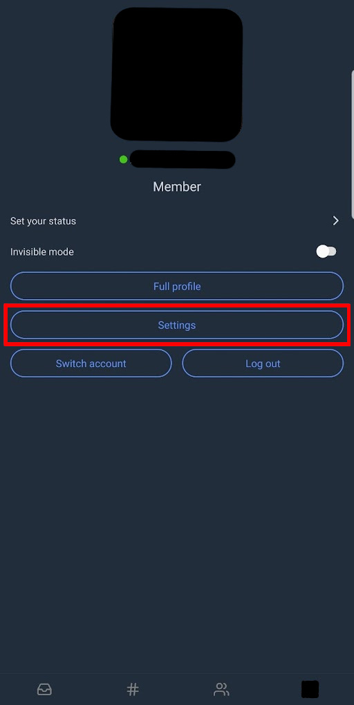
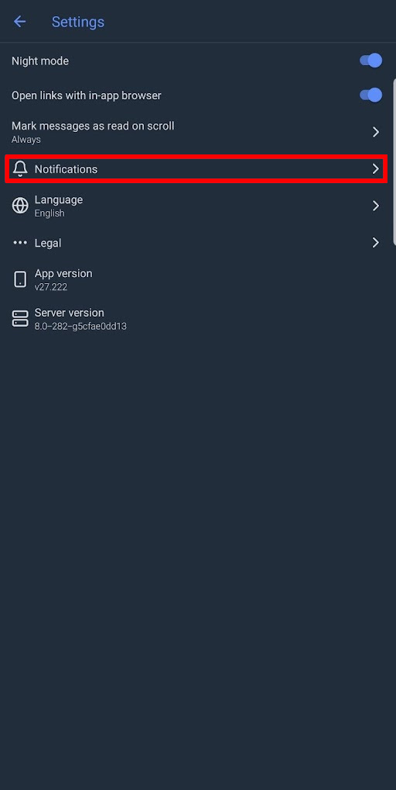
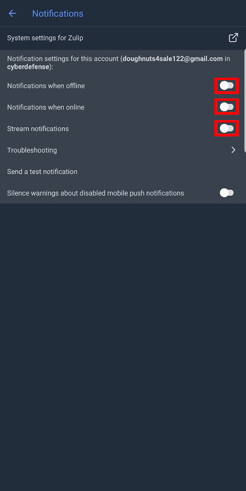
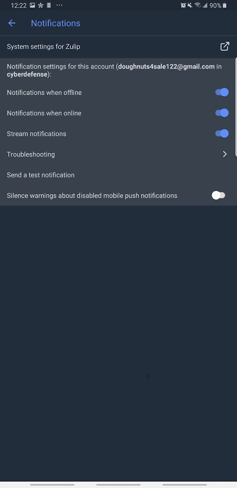

# Enabling notifications on zulip mobile

1. With the app open, select your profile  
    

2. Now open settings  
    

3. Select “Notifications”  
    

4. Turn all notifications on  
    

5. Now it should look like this:  
    
       
That’s all that needs to be done. I hope this was helpful!